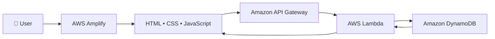

# ☁️ Cloud Fun Facts Generator

A serverless AWS web application that generates random cloud computing facts using **AWS Amplify**, **Amazon API Gateway**, **AWS Lambda**, and **Amazon DynamoDB**.

---

## 🚀 Live Demo

🌐 https://production.d14s2qbgcjgs9r.amplifyapp.com/

---

## 📖 Project Overview

Cloud Fun Facts Generator is a serverless web application built on AWS that delivers random cloud computing facts through a REST API.

The frontend is hosted on AWS Amplify and communicates with Amazon API Gateway, which invokes an AWS Lambda function. Lambda retrieves a random fact from Amazon DynamoDB and returns it to the user in real time.

This project demonstrates how modern serverless applications are built using AWS managed services.

---

## ✨ Features

- Generate random cloud computing facts
- Serverless architecture
- REST API integration
- Real-time responses
- DynamoDB-backed data storage
- Hosted on AWS Amplify
- Responsive web interface

---

## 🏗️ Architecture



---

## ☁️ AWS Services Used

| Service | Purpose |
|---------|---------|
| AWS Amplify | Frontend Hosting |
| Amazon API Gateway | REST API |
| AWS Lambda | Backend Compute |
| Amazon DynamoDB | Database |
| AWS IAM | Permissions |
| Amazon CloudWatch | Logging & Monitoring |

---

## ⚙️ How It Works

1. User opens the application hosted on AWS Amplify.
2. Clicking **Generate Fun Fact** sends a request to Amazon API Gateway.
3. API Gateway invokes an AWS Lambda function.
4. Lambda retrieves a random cloud fact from Amazon DynamoDB.
5. The response is displayed instantly on the webpage.

---

## 📂 Project Structure

```
cloud-fun-facts-generator/
│
├── index.html
├── style.css
├── script.js
└── README.md
```

---

## 🛠️ Tech Stack

- HTML5
- CSS3
- JavaScript
- AWS Amplify
- Amazon API Gateway
- AWS Lambda
- Amazon DynamoDB

---

## 🔮 Future Improvements

- AI-generated cloud facts using Amazon Bedrock
- Copy fact to clipboard
- Dark mode
- Categories for facts
- Search functionality

---

## 👨‍💻 Author

**Md Danish**

- GitHub: https://github.com/MdDanish4300
- Live Demo: https://production.d14s2qbgcjgs9r.amplifyapp.com/

---

⭐ If you found this project interesting, feel free to give it a star!
